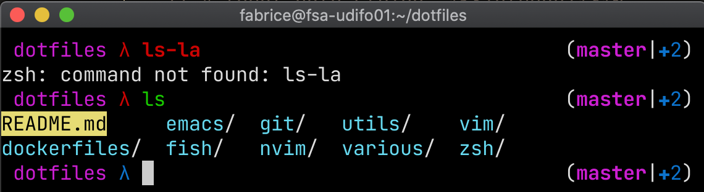

Ducula - A zsh-theme inspired by the Dracula project
====================================================

Prompt features
---------------
 * Job status: Indicates if jobs are running in the background ⍴ (idea from agnoster theme)
 * Virtual environments: Shows the name of activated virtual environment via ${VIRTUAL_ENV}
 * Current path: Display only the last part
 * Return status: Colorize the labmda regarding the last return status
 * Git messages: Uses `git_super_status` from the git-prompt plugin
 * Prompt time: Timestamp (hh:mm)

Example
-------

Installation
------------

Clone the repository into your custom oh-my-zsh themes folder:

    git clone git@github.com:taupezen/Ducula.git ${ZSH_CUSTOM}/themes/Ducula

Set the theme in your .zshrc:

   ZSH_THEME="Ducula/ducula"

Links
-----

Original Ducula theme: <https://github.com/janjoswig/Ducula>

R. Zhao: This blog post (https://rzhao.io/blog/2015/08/26/zsh-prompt/) was the starting point for the theme

The agnoster theme: <https://github.com/ohmyzsh/ohmyzsh/blob/master/themes/agnoster.zsh-theme>

The dieter theme: <https://github.com/ohmyzsh/ohmyzsh/blob/master/themes/dieter.zsh-theme>

The git-prompt plugin: <https://github.com/olivierverdier/zsh-git-prompt>

Dracula: I think the theme works best in connection with the Dracula (https://draculatheme.com/) color theme
